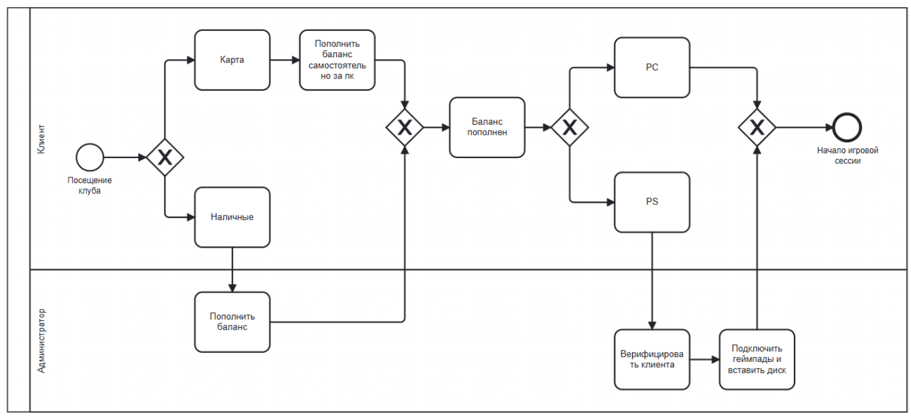
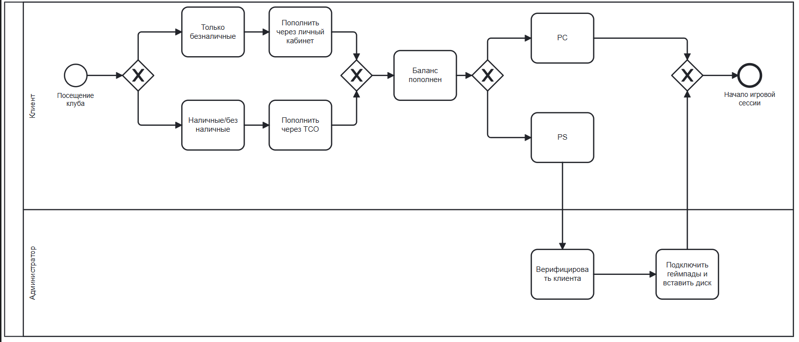
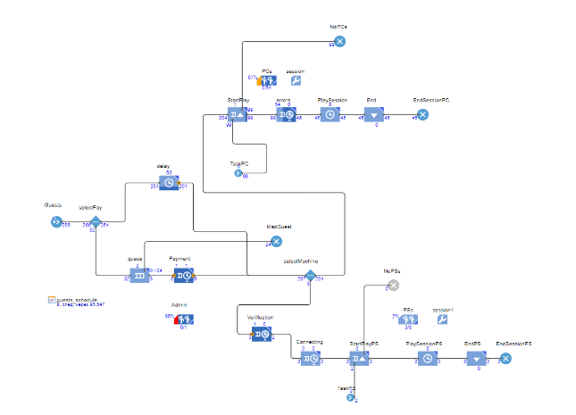
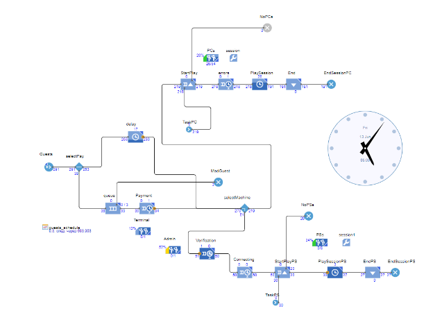

# Внедрение терминала самообслуживания в компьютерном клубе

## 1. Контекст
Компьютерный клуб принимает оплату за игровое время через администратора. Из-за ручной обработки платежей образуются очереди на ресепшене, администратор отвлекается от технической поддержки, растёт риск ошибок при работе с деньгами.

## 2. Цель

Проверить, как внедрение терминала самообслуживания для пополнения игрового баланса повлияет на очереди, нагрузку администратора и качество обслуживания, с помощью имитационного моделирования процесса.

## 3. Как устроен текущий процесс (as-is)

На диаграмме показан клиентский путь: от возникновения потребности провести время в клубе до начала игровой сессии и участии в этом процессе администратора. 

Несмотря на то, что безналичная оплата частично автоматизирована (оплата онлайн за компьютером, по QR‑коду или через облачные платежи), наличные по‑прежнему обрабатываются только через администратора. 
Это приводит к ряду проблем: 
- гости недовольны отсутствием «обычного» терминала, куда можно просто приложить карту;
- администратор вынужден разрываться между обслуживанием очереди, решением технических вопросов и пополнением купюр в кассе;
- прямой доступ к наличным повышает риск ошибок и потенциального воровства.

## 4. Целевой процесс с терминалом (to-be)

Далее я спроектировала целевой вариант, где часть операций переносится на терминал самообслуживания: гость сам выбирает способ оплаты, пополняет баланс, а администратор подключается только при нестандартных ситуациях или настройке PS.

Благодаря этому снижаетмя нагрузка на ресепшн, снижается риск ошибок и злоупотреблений при работе с наличными, а у администратора высвобождается время на техническую поддержку и заботу о гостях.

## 5. Имитационная модель

Перед началом моделирования были собраны данные из базы данных ПО LanGame и проведенных наблюдений в течение месяца. (Уникальные клиенты, средняя продолжительность сессии вероятность возникновения проблемы требующей вмешательства администратора, зависимость посещаемости от выходных/будних, пиковая загруженность) 

### Модель сценария as-is

Модель показывает, сколько гостей одновременно находятся в очереди, как загружается администратор и сколько времени тратится на обработку платежей при текущем процессе.

### Модель сценария to-be

Во втором сценарии часть потока переносится на терминал: уменьшается очередность на ресепшене, администратор меньше времени проводит за кассой и больше — в зале.

## 6. Результаты

Имитационные эксперименты показали, что ручная обработка платежей на ресепшене создаёт очереди и перегружает администратора, который одновременно выполняет кассовые и технические задачи, а также увеличивает время ожидания для клиентов.
В сценарии с терминалом самообслуживания уменьшается время ожидания клиентов и снижается зависимость процесса от «человеческого фактора», что позволяет перераспределить время администратора на поддержку гостей и решение технических проблем.
На основе этого можно рекомендовать внедрение терминала как способ разгрузить персонал и улучшить клиентский опыт без расширения штата.

## 7. Роль в проекте

Описание процессов, сбор исходных данных, построение диграмм, разработка имитационных моделей и анализ результатов экспериментов.

## 8. Используемые инструменты
BPMN — описание процесса пополнения баланса as‑is и to‑be.
AnyLogic — дискретно‑событийное имитационное моделирование процессов клуба.
LanGame — источник статистических данных о потоке клиентов и нагрузке на оборудование.
